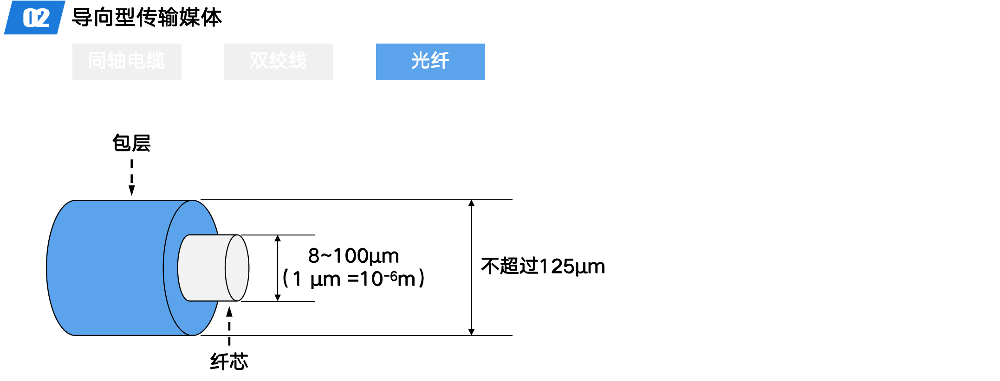
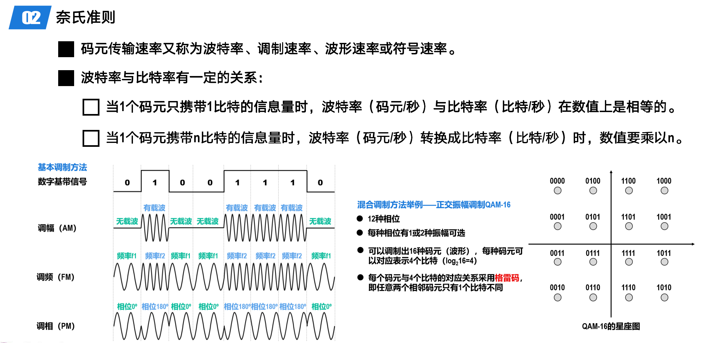
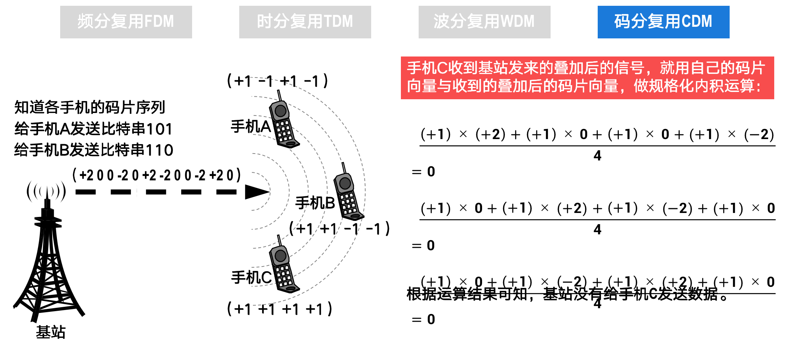

# 物理层

## 考点总结

## 知识总结

## 物理层概述

### 物理层要实现的功能

- 数据链路层“看不见”（也无需看见）物理层究竟使用的是什么方法来传输比特流
- 数据链路层只管“享受”物理层提供的比特流传输服务即可
- 物理层—>物理层：透明传输比特流

### 物理层接口特性

- 物理层接口特性
  - 机械特性
    - 形状和尺寸
    - 引脚数目和排列
    - 固定和锁定装置
  - 电气特性
    - 信号电压的范围
    - 阻抗匹配的情况
    - 传输速率
    - 距离限制
  - 功能特性
    - 规定接口电缆的各条**信号线的作用**
  - 过程特性
    - 规定在信号线上传输比特流的一组操作过程，包括各信号间的**时序关系**

## 物理层下面的传输媒体

### 传输媒体的分类

- 传输媒体的分类
  - 传输媒体是计算机网络设备之间的 物理通路，也称为传输介质或传输没接
  - 传输媒体并不包含在计算机网络体系结构中
    - 应该在物理层下面
  - 分类
    - 导向性传输媒体（固体媒体）
      - 同轴电缆
      - 双绞线
      - 光纤
    - 非导向性传输媒体（自由空间）
      - 无线电波
      - 微波
      - 红外线
      - 大气激光
      - 可见光

#### 导向性传输媒体

##### 同轴电缆

- 同轴电缆
  - 组成
    - 外部保护层
    - 屏蔽层
    - 绝缘体
    - 内导体
  - 分类
    - 基带同轴电缆
      - 用于数字传输，在早期局域网中广泛使用
    - 宽带同轴电缆
      - 用于模拟传输，主要用于有线电视的入户线
  - 同轴电缆价格娇贵且布线不够灵活和方便。随着技术的发展和集线器的出现，在局域网领域基本上都采用双绞线作为传输媒体

##### 双绞线

- 双绞线
  - 绞合的作用
    - 减少相邻导线间的电磁干扰
    - 抵御部分来自外界的电磁干扰

##### 光纤

- 光纤
  - 光纤通信利用光脉冲在光纤中的传递来进行通信
  - 由于可见光的频率非常高（约 10^8MHz量级）
    - 因此**一个光纤通信系统的传输带宽远大于目前其他各种传输媒体的带宽**
  - 传输原理
    - 输入电脉冲
    - 通过发光二极管或者半导体激光器转变为光脉冲
    - 在光纤中进行传输
    - 光脉冲通过光电二极管或激光检波器转变为电脉冲输出

- 光纤
  - 原理
    - 当光从高折射率的媒体射向低折射率的媒体时，其折射角大于入射角
    - 如果入射角足够大，就会出现全反射，即光碰到表层时，就会反射回纤芯
  - 分类
    - 多模光纤
      - 多条广播在多模光纤中不断地全反射
      - 只适合于建筑物内的**近距离传输**
      - 发光二极管 —> 光电二极管
    - 单模光纤
      - 光在单模光纤中一直向前传播
      - **适合长距离传输且衰减更小**
      - 半导体激光器 —> 激光检波器

- 光纤
  - 优点
    - 通信容量非常大
    - 抗雷电和电磁干扰性能好
    - 传输损耗小，中继距离长
    - 无串音干扰，保密性好
    - 体积小，重量轻
  - 缺点
    - 切割光纤需要较贵的专用设备
    - 目前光电接口还比较昂贵

#### 非导向性传输媒体

##### 无线电波

- 波

  - 0~10^4 Hz
    - 一般不用于通信
  - 10^4 ~ 10^15 Hz
    - 调制波的振幅、频率或相位来传输信息
  - 10^15~10^100 Hz
    - 很难产生和调制
    - 绕过障碍物能力很弱
    - 对生物有害

  

- 无线电波
  - 低频、中频
    - 延着地球表面进行传播
  - 高频、甚高频
    - 在地表会被地表吸收
    - 一般先传播到地球上方 100~500 千米高空处的带电离子层，再依靠反射回地球表面

##### 微波

- 微波
  - 主要沿直线传播，会穿透电离层而进入宇宙空间
    - 地面微波接力通信
      - 信号塔之间 50~100km 的距离
    - 卫星通信
      - 单颗同步地球卫星通信覆盖区跨度 18000km，面积约占地球表面 1/3

##### 红外线

- 红外线
  - 遥控器
  - 以前的笔记本电脑具有红外接口（现在已经被淘汰）
    - 点对点无线传输
    - 直线传输，中间不能有障碍物，传输距离短
    - 传输速率低（4Mb/s ~ 16Mb/s）

##### 激光

- 激光
  - 特点
    - 亮度高
    - 方向强
    - 单色性好
    - 相干性强
  - 按传输媒体的不同进行分类
    - 大气激光通信：利用大气作为传输媒体的激光通信
      - 保密性强、结构轻便、设备经济
      - 通信距离短，受天气影响，瞄准困难
    - 光纤通信：利用光纤传播光信号

##### 可见光

- 发展迅速

## 传输方式

### 串行传输和并行传输

#### 串行传输

- 串行传输
  - 在发送端和接收端之间只有一条数据传输线路
  - 构成数据的多个比特在这条数据传输线路上逐比特依次传输
  - 远距离传输一般采用串行传输方式

#### 并行传输

- 并行传输
  - 在发送端和接收端之间有多条数据传输线路
  - 构成数据的多个比特被分别安排在不同的数据传输线路上同时传输
  - 若比特在单条数据传输线路上的数据传输速率相同
    - 则并行传输的数据传输速率是串行传输的数据传输速率的 n 倍
    - 倍数 n 取决于并行传输所采用的数据传输线路的数量，也称为数据总线宽度
    - 常见 8 位、16 位、32 位、64 位
  - 并行传输的成本高，通常仅用于短距离传输，例如计算机内部的数据传输

- 计算机中的网卡同时具有串行传输和并行传输方式
  - 当计算机通过内部网卡将数据发送到传输线路上时，网卡起到的重要作用就是并/串转换
  - 当计算机通过其内部网卡从传输线路上接收数据时，网卡起到的重要作用就是串/并转换

### 同步传输和异步传输

#### 同步传输

- 同步传输
  - 以比特为传输单位，数据块以比特流的形式传输
  - 字节之间没有间隔，也没有起始位和终止位
  - 接收端在比特信号的中间时刻进行采样，以判别接收到的是比特 0 还是 1
    - 要求收发双方对表示比特的信号的时间长度达成一致，即同步
    - 然而在不采取其他任何措施的情况下，收发双方的时钟频率无法达到严格同步
    - 在采用过程中，必然会出现收发双方时钟频率的误差积累造成比特信号采样时刻的严重偏移
    - 最终会导致接收端对比特信号的误判
  - 收发双方时钟同步的方法
    - **外同步**
      - 在收发双方之间增加一条时钟信号线
    - **内同步**
      - 发送端将时钟信号编码到发送数据中一起发送（如曼彻斯特编码）

#### 异步传输

- 异步传输
  - 以字节为传输单位，**字节之间异步，**但字节之间的时间间隔不固定
    - 接收端只在每个字节的起始处对字节内的比特实现同步
    - 一般要对每个字节添加起始位和结束位
  - **字节中的每个比特仍然要同步**，即各个比特的持续时间是相同的

#### 单向通信、双向通信、双向同时通信

- 单向通信（单工通信）
  - 只能从发送端传递数据信号到接收端
  - 接收端不能发送信号到发送端
  - 例子：无线电广播
- 双向交替通信（半双工）
  - 可以双向通信，即发送端—>接收端，接收端—>发送端
  - 但是不能同时进行通信，一个结束另一个才可以开始
  - 例子：总线上的计算机、对讲机、单工电台
- 双向同时通信(全双工)
  - 通信双方都可以同时发送信息和接收信息
  - 例子：手机

## 编码与调制

### 基本概念

- 编码与调制
  - 信息
    - 文字、图片、音频、视频
  - 数据
    - 运送消息的实体
  - 信号
    - 数据的电磁表现
  - 数字基带信号
    - 计算机发出的数字信号
- 数字信号通过基带调制(编码)
  - 通过数字信道传输
  - 以太网采用的曼彻斯特编码、4B/5B、8B/10B
- 数字信号通过带通调制
  - 通过模拟信道传输
  - Wi-Fi 采用的 CCK/DSSS/OFDM调制

### 码元

- 码元
  - 在使用时间域的波形表示信号时，代表不同离散数值的基本波形称为码元

### 常用编码方式

#### 双极性不归零编码

- 双极性不归零编码
  - **编码效率高，但存在同步问题**（无法判断接收到的码元的准确数量）
  - 需要给收发双方再添加一条时钟信号线
    - 发送方通过时钟信号线给接收方发送数据的同时，还通过时钟信号线给接收方发送时钟信号
    - 接收方按照接收到的时钟信号的节拍，对数据信号线上的信号进行采样
  - 但是对于计算机网络，宁愿利用这根传输线传输数据信号，而不是传输时钟信号

#### 双极性归零编码

- 双极性归零编码
  - 自同步，但编码效率低
  - 在每个码元的中间时刻都会回归到零电平
  - 接收方只要在信号归零后采样即可
  - 归零编码相当于将时钟信号用“归零”方式编码在了数据之内，这称为"自同步"信号
  - 归零编码中大部分的数据带宽，都用来传输“归零”而浪费掉了

#### 曼彻斯特编码

- 曼彻斯特编码（检查跳变方向）
  - 自同步，10Mb/s传统以太网
  - 码元中间时刻的电平跳变既表示时钟信号，也表示数据
  - 正跳变和负跳变表示的含义可以自行定义

- 差分曼彻斯特编码（检查有无跳变）
  - 码元中间时刻的电平跳变仅表示时钟信号，而不表示数据
  - **数据的表示在于每一个码元开始处是否有电平跳变：无跳变表示 1，有跳变表示 0**
  - 对比
    - 在传输大量连续1或连续0的情况下，差分曼彻斯特编码信号比曼彻斯特编码信号的变化少。         
    - 在噪声干扰环境下，检测有无跳变比检测跳变方向更不容易出错，因此差分曼彻斯特编码信号比曼彻斯特编码信号更易于检测。         
    - 在传输介质接线错误导致高低电平翻转的情况下，差分曼彻斯特编码仍然有效。

### 基本的带通调制方法和混合调制方法

#### 基本的带通调制方法
##### 调幅（AM）

##### 调频（FM）

##### 调相（PM）

#### 混合调制方法

- 使用基本调制方法，1 个码元只能包含 1 个比特信息
- 如何使 1 个码元包含更多个比特信息

- 频率和相位
  - 因为载波的频率和相位是相关的，即频率是相位随时间的变化率
  - 所以载波的频率和相位不能进行混合调制

- 相位和振幅
  - 通常情况下，载波的相位和振幅可以结合起来一起调制
    - 例如正交 振幅调制 QAM

- 正交振幅调制
  - 12 种相位
  - 每种相位有 1或 2 种振幅可选
  - 可以调制出 16 种码元（波形），每种码元可以对应表示 4 个比特（log2 16 = 4）
  - 每个码元与4个比特的对应关系采用格雷码，即任意两个相邻码元只有1个比特不同

## 信道的极限容量

### 造成信号失真的主要因素

- 造成信号失真的主要因素
  - 码元的传输速率
    - 传输速率越高，信号经过传输后的失真就越严重
  - 信号的传输距离
    - 传输距离越远，信号经过传输后的失真就越严重
  - 噪声干扰
    - 噪声干扰越大，信号经过传输后的失真就越严重
  - 传输媒体质量
    - 传输媒体质量越差，信号经过传输后的失真就越严重

- 信道上传输的**数字信号**，可以看做是**多个频率的模拟信号进行多次叠加后形成的方波**
- 如果数字信号中的高频分量在传输时收到衰减甚至不能通过信道，则接收端接收到的波形前沿和后沿就变得不那么陡峭，每一个码元所占的事件界限也不再明确。
  - 这样在接收端接收到的信号波形就失去了码元之间的清晰界限，这种现象称为**码间串扰**
- 如果**信道的频带越宽**，则**能够通过的信号的高频分量就越多**，那么**码元的传输速率就可以更高**，而**不会产生码间串扰**
- 然而**信道的频率带宽是有上限的**，不可能无限大
  - 因此，**码元的传输速率也有上线**

### 奈氏准则

- 奈氏准则
  - **理想低通信道的最高码元传输速率 = 2W Baud= 2W 码元/秒**
    - W：信道的频率带宽（单位为Hz）
    - Baud：波特，即码元/秒
  - 使用奈氏准则给出的公式，就可以**根据信道的频率带宽，计算出信道的最高码元传输速率**。
  - 只要码元传输速率不超过根据奈氏准则计算出的上限，就可以避免码间串扰。
  - 奈氏准则给出的是理想低通信道的最高码元传输速率，它和实际信道有较大的差别。因此，一个实际的信道所能传输的最高码元传输速率，要明显低于奈氏准则给出的上限值。

- 奈氏准则
  - 码元传输速率又称为波特率、调制速率、波形速率或符号速率
  - 波特率与比特率有一定关系
    - 当 1 码元只携带 1 波特的信息量时，波特率（码元/秒）与比特率（比特/秒）在数值上时相等的
    - 当1个码元携带n比特的信息量时，波特率（码元/秒）转换成比特率（比特/秒）时，数值要乘以n

### 香农公式

- 香农公式
  - 带宽受限且有高斯白噪声干扰的信道的极限信息传输速率
  - C=Wlog2 (1+S/N)
    - C：信道的极限信息传输速率（单位为b/s）
    - W：信道的频率带宽（单位为Hz）
    - S：信道内所传信号的平均功率
    - N：信道内的高斯噪声功率
    - S/N：信噪比，使用分贝（dB）作为度量单位
      - 信噪比（dB）=10log_10(S/N)（dB）
  - 信道的频率带宽W或信道中的信噪比S/N越大，信道的极限信息传输速率C就越高。
  - 实际信道不可能无限制地提高频率带宽W或信道中的信噪比S/N。
  - 实际信道中能够达到的信息传输速率，要比香农公式给出的极限传输速率低不少。这是因为在实际信道中，信号还要受到其他一些损伤，例如各种脉冲干扰和信号衰减等，这些因素在香农公式中并未考虑。

- 在信道的频率带宽W一定的情况下，根据奈氏准则和香农公式，要**想提高信息的传输速率，就必须采用多元制（更复杂的调制技术），并努力提高信道中的信噪比**。                  
- 自从香农公式发表后，各种新的信号处理和调制方法就不断出现，其目的都是为了使码元可以携带更多个比特，进而可以尽可能地接近香农公式给出的传输速率极限。

## 信道复用技术

### 基本原理

- 复用
  - 就是在**一条传输媒体上同时传输多路用户的信号**
  - 当一条传输媒体的传输容量大于多条信道传输的总容量时，就可以通过复用技术，在这条传输媒体上建立多条通信信道，以便**充分利用传输媒体的带宽**
  - 尽管实现信道复用会增加通信成本（需要复用器、分用器以及费用较高的大容量共享信道），但如果复用的信道数量比较大还是很划算的

### 常见的信道复用技术

#### 频分复用 FDM

- 频分复用
  - **所有用户同时占用不同的频带资源并行通信**
  - 各个子信道(子频带)之间有隔离频带

#### 时分复用 TDM

- 时分复用
  - 各用户时隙周期性出现
    - 周期为 TDM 帧的长度
  - **时分复用的所有用户在不同的时间占用同样的频带**
  - TDM 帧实际上是一段固定长度的时间，它与数据链路层对等实体间逻辑通信的“帧”是完全不同的概念

#### 波分复用WDM

- 波分复用
  - 根据频分复用的设计思想，可在一根光纤上同时传输多个频率（波长）相近的光载波信号，实现基于光纤的频分复用技术。
  - 目前可以在一根光纤上复用80路或更多路的光载波信号。因此，这种复用技术也称为密集波分复用DWDM。
  - 铺设光缆的工程耗资巨大，应尽量在一根光缆中放入尽可能多的光纤，然后对每一根光纤使用密集波分复用技术。
    - 例如，在一根光缆中放入100根速率为2.5Gb/s的光纤，对每根光纤采用40倍的密集波分复用，则这根光缆的总数据速率为（2.5Gb/s × 40）× 100 = 10000Gb/s = 10Tb/s。

#### 码分复用CDM

- 码分复用（Code Division Multiplexing，CDM）
  - 常称为码分多址（Code Division Multiple Access，CDMA）
  - 它是在扩频通信技术的基础上发展起来的一种无线通信技术
  - 与FDM和TDM不同，CDMA的每个用户可以在相同的时间使用相同的频带进行通信 
  - CDMA最初用于军事通信，这种系统发送的信号有很强的抗干扰能力，其频谱类似于白噪声，不易被敌人发现。

- 码片
  - CDMA 将每个比特时间划分为 m 个更短的时间片，称为码片
  - m 的取值通常为 64 或 128
  - 假设 m 为 8
- CMDA 中的每个站点都被指派一个唯一的 m 比特码片序列
  - 某个站要发送比特 1，则发送它自己的 m 比特码片序列
  - 某个站要发送比特 0，则发送它自己 m 比特码片序列的反码
    - 假设给某个站指派的8比特码片序列为01011001
      - 该站发送比特 1：发送自己的 8 比特码片序列 01011001
      - 该站发送比特 0：发送自己的 8 比特码片薛烈 01011001 的反码 10100110
    - 将码片序列中的比特 0 记为-1，而比特 1 记为+1，可写出码片序列相应的码片向量
    - 在本例中，该站的码片向量为（-1 +1 -1 +1 +1 -1 -1 +1）

- 码分复用
  - 如果有两个或多个站同时发送数据，则信道中的信号就是这些站各自所发送一系列码片序列或码片序列反码的叠加
  - 为了从信道中分离出每个站的信号，给每个站指派码片序列时，必须遵循以下规则
    - 分配给每个站的码片序列必须各不相同，实际常采用伪随机码序列
    - 分配给每个站的码片序列必须相互正交，即各码片序列相应的码片向量之前的规格化内积为 0
      - 令向量 A 表示站 A 的码片向量，向量 B 表示站B的码片向量
      - 两个不同站 A 和 B 的码片序列相互正交，就是向量 A 与向量 B 的规格化内积为 0，如下式所示

- 两个码片序列相互乘积等于 0
  - A*B = 0
- 码片自身乘积等于 1
  - A*A=1
- 码片与自身反码乘积等于-1
  - A * -A = -1

- 信号站只要把 A+ (-B)发送给各个手机，就能传递信息

  - 知道各手机的码片序列

  - 给手机 A 发送比特 1

  - 给手机 B 发送比特 0

- 各手机用自己的码片向量与收到的叠加后的码片向量做规格化内积运算

- 手机 A 收到的信号

- 手机B 收到的信号

- 手机 C 收到的信号

