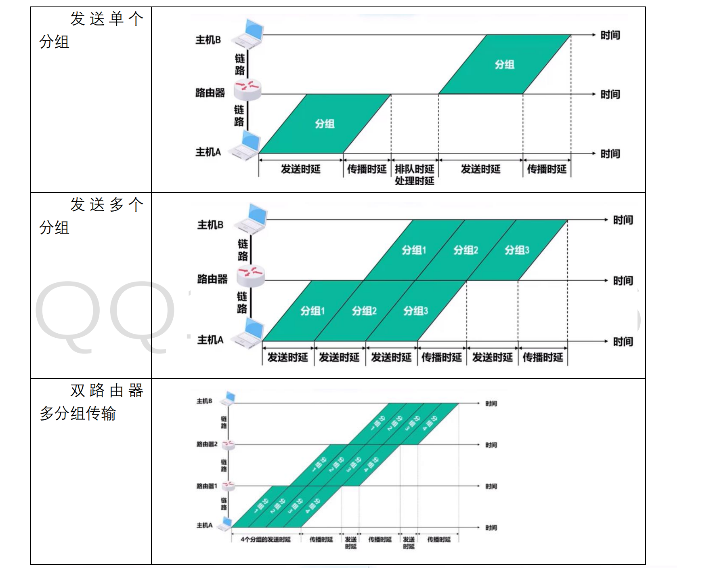
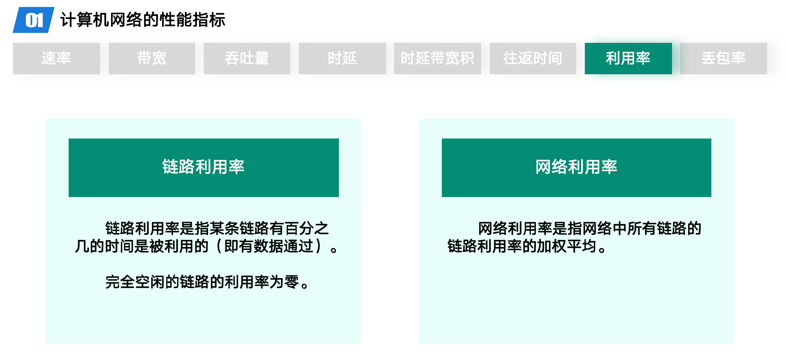
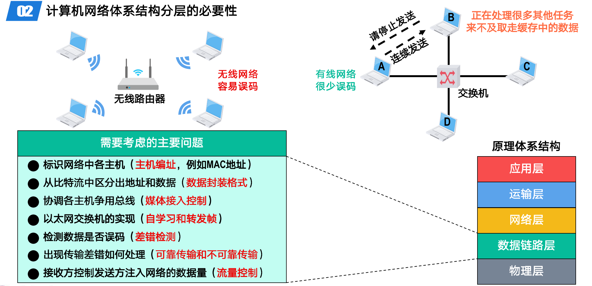
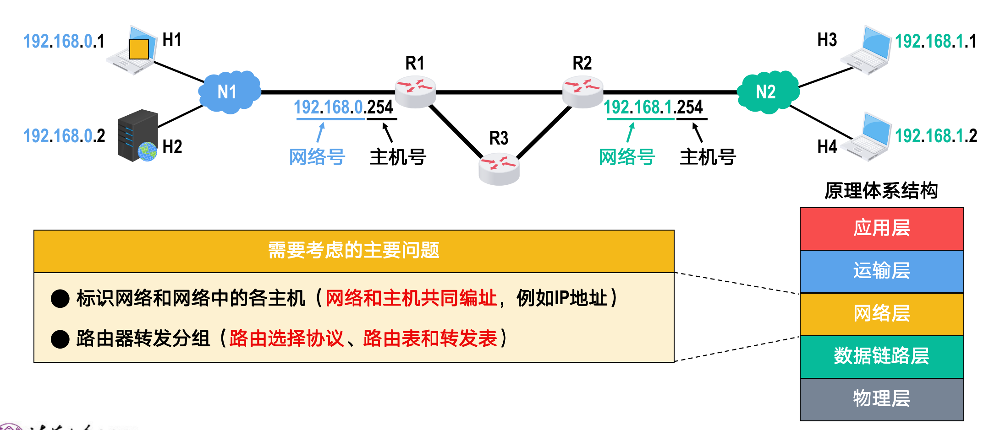
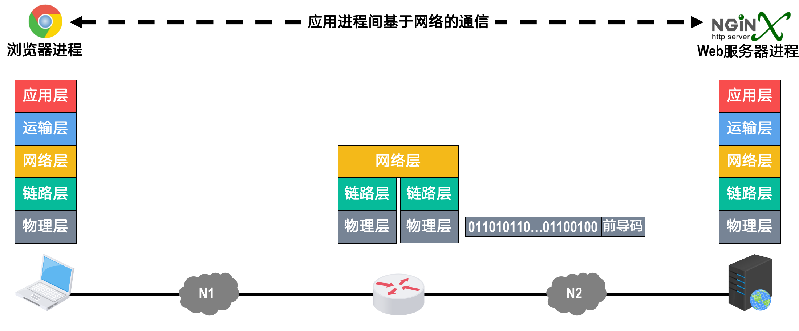
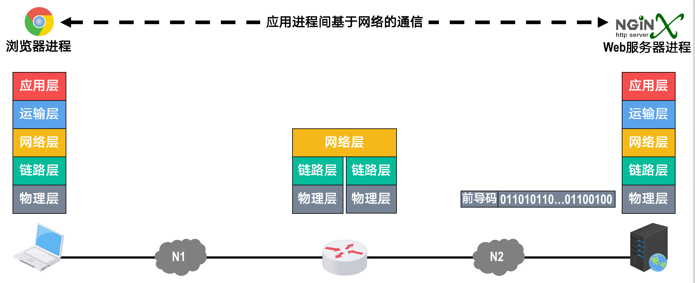

# 计算机网络概述

## 考点总结

## 知识总结

- 主机
  - 应用层
    - HTTP 请求报文：请求 Web 服务器执行相应操作
  - 运输层
    - TCP 报文段：区分应用进程，实现可靠传输
  - 网络层
    - IP 数据报：IP 寻址和路由
  - 链路层
    - 以太网帧：MAC 寻址和帧校验
  - 物理层
    - 比特流：转换成电信号
      - 前导码：使接收方的时钟同步并做好接收准备

- 主机将电信号发送出去

- 路由器
  - 物理层
    - 收到电信号，将电信号转换成比特流
    - 将前导码去掉后，将帧向上交付给数据链路层
  - 数据链路层
    - 将帧首部和尾部去掉后，将 IP 数据报向上交付给网络层
  - 网络层
    - 从 IP 数据报的首部中提取出目的 IP 地址
    - 根据目的 IP 地址查找自己的转发表以便决定从哪个接口转发该 IP 数据报
    - 以此同时对首部中的某些字段值（例如生存时间 TTL 字段的值进行相应的修改）
    - 然后将该 IP 数据报向下交付给数据链路层
  - 数据链路层
    - 为 IP 数据报添加一个首部和一个尾部，将其封装成为帧
    - 然后将帧向下交付给物理层
  - 物理层
    - 将帧看作成比特流
    - 为其添加前导码，转换成相应的电信号发送出去

- web 服务器
  - 收到数据包，按网络体系结构自下而上的顺序对其进行逐层解封，解封出 HTTP 请求报文
  - 应用层
    - 给主机发送包含有浏览器请求内容的 HTTP 响应报文
  - 与浏览器发送 HTTP 请求报文的过程类似，HTTP 响应报文需要在 Web 服务器层层封装后才能发送
- 数据包通过路由器的转发到达主机
- 主机对收到的数据包，按网络体系结构自下而上的顺序逐层解封，解封出 HTTP 响应报文

## 信息时代的计算机网络

## 因特网概述

### 网络、互联网那个与因特网的区别与关系

- 网络、互联网与因特网的区别与关系
  - 若干节点和链路互联形成网络
  - 若干网络通过路由器互联形成互联网
  - 因特网是当今世界上最大的互联网
- 我们有时并没有严格区分互联网和因特网这两个名词，许多人口中的互联网实际上是指因特网

- internet
  - 通用名词
  - 互联网
  - 任意通信协议
- Internet
  - 专用名词
  - 因特网
  - TCP/IP协议族

### 因特网简介

- 因特网的诞生时间：1983 年

- 因特网服务提供者（Internet Service Provider，ISP）
  - 联通、电信、移动

- 因特网已经发展成为基于 ISP 的多层次结构的互联网络

- 因特网标准化工作
  - 因特网的标准化工作是面向公众的，其任何一个建议标准在成为因特网标准之前都以 RFC 技术文档的形式在因特网上发表
  - RFC（Request For Comments）的意思是“请求评论”
    - 任何人都可以在因特网上免费下载 RFC 文档，并随时对某个 RFC 文档发表意见和建议

- 因特网的管理机构
  - 因特网协会（ISOC）
  - 因特网体系结构委员会（IAB）
  - 因特网工程部（IETF）、因特网研究部（IRTF）

- 因特网的组成
  - 边缘部分
    - 主机  打印机 手表  平板  手机
  - 核心部分
    - 网路  路由器

### 三种交换

#### 电路交换

- 电路交换
  - 建立连接
    - 分配通信资源
  - 通话
    - 一直占用通信资源
  - 释放连接
    - 归还通信资源

- 计算机通信数据传输不可以使用电路交换
  - **计算机之间的数据传送是突发式的**，当**使用电路交换**来传送计算机数据时，其**线路的传输效率一般都会很低**
  - 线路上真正用来传送数据的事件往往不到 10%甚至 1%

#### 分组交换

- 从源站到目的站传输的最简单过程

- 分组交换
  - 将 h1 的数据传输到 h3 的设备上来
    - 考虑到中间交换机的缓存容量，所以采用报文的方式，将长数据分解成一段段的带首部的短数据。
    - 分组交换网中的节点先缓存短数据，然后从首部中提取出目的的地址，按照目的地址查找自己的转发表，找到相应的转发接口后，将分组转发出去把分组交给下一个转发节点，经过多个节点的存储转发后，分组最终转发到目的主机。
    - 主机 h3 接收到数据后，去掉首部，将各数据段组合还原出原始报文。

- 发送方
  - 构造分组
  - 发送分组
- 交换节点
  - 缓存分组
  - 转发分组
- 接收方
  - 接收分组
  - 还原报文

- 优点
  - 没有建立连接和释放连接的过程
  - 分组传输过程中逐段占用通信链路，有较高的通信线路利用率
  - 交换节点可以为每一个分组独立选择转发路由，使得网络有很好的生存性
- 缺点
  - 分组首部带来了额外的传输开销
  - 交换节点存储转发分组会造成一定的时延
  - 无法确保通信时端到端通信资源全部可用，在通信量较大时可能造成网络阻塞
  - 分组可能会出现失序和丢失等问题

#### 报文交换

- 报文交换
  - 报文交换是分组交换的前身
  - 在报文交换中，**报文被整个地发送**，而不是拆分成若干个分组进行发送
  - 交换节点将报文**整体接收完成**后才能查找转发表，将整个报文转发到下一个节点
  - 因此，报文交换比分组交换带来的**转发时延要长很多**，需要交换节点具有的**缓存空间也大很多**

#### 三种交换方式的对比

- 三种交换方式的对比
  - 若要连续传送大量的数据，并且数据传送时间远大于建立连接的事件，则使用电路交换可以有较高的传输效率
    - 然而计算机的数据传送往往是突发式的，采用电路交换时通信线路的利用率会很低
  - 报文交换和分组交换都**不需要建立连接**（即预先分配通信资源），在**传送计算机的突发数据时可以提高通信线路的利用率**
  - 将报文构造成若干个更小的分组进行分组交换，比将整个报文进行报文交换的时延要小，并且还可以避免太长的报文长时间占用链路，有利于差错控制，同时具有更好的灵活性

### 计算机网络的定义和分类

#### 定义

- 计算机网络的定义
  - 没有精确和统一的定义
  - 不同阶段，不同定义，反应当时计算机网络技术的发展水平

- 计算机网络早期的一个最简单定义
  - 互连
  - 自治
  - 计算机集合

- 现阶段计算机网络的一个较好的定义
  - 计算机网络主要是由一些通用的、可编程的硬件互连而成的，硬件之间可以传送多种不同类型的数据。
    - 例如：传送数据或视频信息
    - 可编程的硬件
      - 不限于计算机而是包括了智能手机、具有网络功能的传感器以及智能家电等智能硬件，这些硬件一定包含有中央处理单元 CPU
    - 各类应用
      - 计算机网络并非只用来传送数据，而是能够基于数据传送进而实现各种各样的应用，包括今后可能出现的各种应用
  - 这些可编程的硬件能够用来传送多种不同类型的数据，并能支持广泛的和日益增长的应用

#### 分类

##### 交换方式

##### 使用者

- 公用网
  - 因特网
- 专用网
  - 军队、铁路、电力、银行等

##### 传输介质

- 无线网络
- 有线网络
  - 双绞线网络
  - 光纤网络

##### 覆盖范围

- 覆盖范围
  - 广域网（WAN）
    - 几十到几千千米
  - 城域网（MAN）
    - 5 到 50 千米
  - 局域网（LAN）
    - 1 千米左右
  - 个域网（PAN）
    - 10 米

##### 拓扑结构

- 按拓扑结构分类
  - 可分为总线型、星型、环型、网状型
    - 总线型：使用单根传输线把计算机连接起来
      - 优点：建网容易，增减节点方便，节省线路
      - 缺点：重负载时通信效率不高，总线任意一处出现故障，则全网瘫痪
    - 星型：每个计算机都以单独的线路与中央设备相连
      - 中央设备早期是计算机，后来是集线器，现在一般是交换机和路由器
      - 优点：便于网络的集中控制和管理
      - 缺点：成本高，中央设备对故障敏感
    - 环形：所有计算机的网络接口都连接成一个环
      - 令牌环局域网
      - 环可以是单环也可以是双环，环中信号是单向传输的
    - 网状型：每个节点至少有两条路径与其他节点相连
      - 多用在广域网中
      - 优点：可靠性高
      - 缺点：控制复杂，线路成本高
  - 四种网络拓扑可以互连成更复杂的网络

## 计算机网络的性能指标

- 计算机网络的性能指标
  - 计算机网络的性能指标被用来从不同方面度量计算机网络的性能
  - 常用的八个计算机网络的性能指标
    - 速率
    - 带宽
    - 吞吐量
    - 时延
    - 时延带宽积
    - 往返时间
    - 利用率
    - 丢包率

### 速率

- 速率
  - 比特（bit，记为小写 b）
    - 是计算机中数据量的基本单位，一个比特就是二进制数字的一个 1 或 0
    - 数据量的常用单位有字节（byte，记为大写B）、千字节（KB）、兆字节（MB）、吉字节（GB）以及太字节（TB）
  - 定义
    - 速率是指数据的传送速率（即每秒传送多少个比特），也成数据率（Data Rate）或比特率（Bit Rate）
    - 速率的基本单位是比特/秒（bit/s，可简记为b/s，有时也记为bps，即bit per second）。速率的常用单位有千比特/秒（kb/s或kbps）、兆比特/秒（Mb/s或Mbps）、吉比特/秒（Gb/s或Gbps）以及太比特/秒（Tb/s或Tbps）

### 带宽

- 带宽
  - 在模拟信号系统中的意义
    - **某个信号所包含的各种不同频率成分所占据的频率范围**
    - 单位
      - Hz（kHz, MHz, GHz）
      - 电话语音主要成分的频率范围：带宽3.1kHz（300Hz~3.4kHz）
  - 带宽在网络中的意义
    - 用来表示网络的**通信线路所能传送数据的能力**，即在单位时间内从网络中的某一点到另一点所能通过的**最高数据率**
    - 单位
      - b/s（kb/s，Mb/s，Gb/s，Tb/s）

- 数据传输速率
  - 木桶效应
  - min{ 主机接口速率，线路带宽，交换机或路由器的接口速率 }
- 光纤网络速度快的根本原因
  - 不是光在光纤中的速度快，电磁波在铜线中的传播速度比它还快
  - 光纤的带宽很大，也就是所能承载的最高数据传送速率很大
    - 单位时间内可以传送更多的比特
  

### 吞吐量

- 吞吐量
  - 单位时间内通过某个网络或接口的实际数据量
  - 吞吐量常被用于对实际网络的测量，以便获知到底有多少数据量通过了网络
  - 吞吐量受网络带宽的限制

### 时延

- 时延

  - 定义

    - 指数据从网络的一端传送到另一端所耗费的事件，也称为延迟或迟延
    - 数据可由一个或多个分组甚至是一个比特构成

  - 发送时延
  - 源主机发送数据时，将数据进行分组
    - 发送速率 = min{ 主机接口速率，线路带宽，交换机或路由器的接口速率 }
    - 速率 = 分组长度（b）/ 发送速率（b/s）

  - 传播时延

    - 数据在传播介质上传输
    - 确定传播介质（铜线，自由空间，光纤）
    - 速率 = 信道长度（m）/ 信号传播速率（m/s）

  - 排队时延

    - 定义

      - 分组好的数据在路由器的输入队列中排队缓存并等待处理，在路由器确定了分组的转发接口后，分组会在输出队列中排队缓存并等待转发。
      - 分组在路由器的输入队列和输出队列中排队缓存所耗费的时间就是排队时延

    - 速率无法计算的原因

      - 在分组从源主机传送到目的主机的过程中，分组往往要经过多个路由器的转发，分组在每个路由器上产生的排队时延的长短，往往取决于网络当时的通信量和路由器的自身性能
      - 由于网络的通信量随时间变化很大，各个路由器的性能也可能并不完全相同，因此排队时延一般无法用一个简单的公式进行计算
      - 当网络通信量比较大的时候，可能会造成路由器的队列溢出，使分组丢失，这相当于排队时延无穷大

  - 处理时延
	  - 定义
      - 路由器从自己的输入队列中取出排队缓存并等待处理的分组后会进行一系列的处理工作
      - 如检查分组的首部是否误码，提取分组首部的目的地址，为分组查找相应的转发接口以及修改分组首部的部分内容（例如生存时间等）
      - 路由器对分组进行这一系列处理工作所耗费的时间，就是处理时延
    - 速率
      - 处理时延一般也无法用一个简单的公式进行计算

- 分组通过路由器的转发传输到目的主机，又会耗费路由器的一个发送时延，以及代表该分组的电信号在另一端链路上传播所耗费的传播时延
- 为什么没有接收时延？
  - 目的主机接收分组信号，与分组信号在链路上传播是同时进行的
  - 如果在总时延中包含接收时延，就把这一部分时间重复计算了

- 例题

- 数据传输时发送时延和传播时延谁占主导？
  - 具体问题具体分析，不一定谁占主导

### 时延带宽积

- 时延带宽积是传播时延（时间）和带宽的乘积
  - 其实就是在这个链路中有多少个比特在传播
  - 链路的时延带宽积也称为**以比特为单位的链路长度**

### 往返时间

- 往返时间（RTT）
  - 从发送端发送数据分组开始，到发送端收到接收端发来的相应确认分组为止，总共耗费的时间

- 一般来说，卫星链路耗时最多

### 利用率

- 链路利用率
  - 某条链路有百分之几的事件是被利用的（即有数据通过）
  - 完全空闲的链路的利用率为零
- 网络利用率
  - 网络利用率是指网络中所有链路的链路利用率的加权平均
- 根据排队论可知
  - **当某链路的利用率增大时，该链路引起的时延就会迅速增加**
- 当网络的通信量较少时，产生的时延并不大
  - 但在**网络通信量不断增大时，分组在交换节点（路由器或交换器）中排队时延就会随之增大**，因此网络引起的时延就会增大
- 令 D0 表示网络空闲时的时延，D 表示网络当前的时延，那么在理想的假定条件下，可用下式来表示 D、D0 和网络利用率 U 之间的关系
  - D=D0/(1-U)
  - 网络利用率不是越大越好，当利用率大于 0.5 之后，网络时延急剧增大
  - 一些大型 ISP 会控制信道利用率不超过 50%，如果超过了就要进行扩容，增大线路的带宽

### 丢包率

- 丢包率
  - 定义
    - **在一定的时间范围内，传输过程中丢失的分组数量与总分组数量的比率**
  - 分类
    - 接口丢包率
    - 网络丢包率
    - 节点丢包率
    - 路径丢包率
    - 链路丢包率
  - 丢包的原因
    - 分组在传输过程中出现误码，被传输中的节点交换机（例如路由器）或目的主机检测出误码而丢弃
    - **节点交换机根据丢弃策略主动丢弃分组**（排队队列满）
  - 丢包率可以反应网络的拥塞情况
    - 无拥塞时路径丢包率为0
    - 轻度拥塞时路径丢包率为1%~4%。
    - 严重拥塞时路径丢包率为5%~15%。

## 计算机网络的体系结构

### 常见的三种计算机网络体系结构

#### OSI 参考模型

- OSI 参考模型（七层）
  - 应用层
  - 表示层
  - 会话层
  - 运输层
  - 网络层
  - 数据链路层
  - 物理层
- 缺点
  - 专家没有实际经验，完成标准时没有商业驱动力
  - 协议实现过分复杂，运行效率很低
  - 标准的制定周期太长，产品无法及时进入市场
  - 层次划分不太合理，有些功能在多个层次中重复出现

#### TCP/IP参考模型

- TCP/IP参考模型（四层）
  - 应用层
  - 运输层
  - 网际层
  - 网络接口层

- 计算机和服务器会有四层
- 路由器等中转交换设备只会有网际层和网络接口层

- TCP/IP协议族
  - 网络接口层
    - 以太网、WIFI、接口 m
  - 网际层
    - 使用 IP 协议互连不同的网络接口（IP over everything）
    - **IP**
    - IP 协议可以为各种网络应用提供服务（everything over IP）
  - 运输层
    - **TCP、UDP**
  - 应用层
    - **HTTP、SMTP、DNS、RTP**

#### 原理参考模型

- 原理参考模型
  - 应用层
  - 运输层
  - 网络层
  - 数据链路层
  - 物理层

### 分层的必要性

- 分层的必要性
  - 计算机网络是个非常复杂的系统
  - 分层可将庞大复杂的问题转化为若干较小的局部问题

- 物理层问题
  - 采用什么传输媒体（介质）（不是物理层，在物理层之下）？
    - 同轴电缆、双绞线电缆、光纤、光缆
  - 采用什么物理接口
  - 采用什么信号表示比特 0 和 1？
    - 高电平：1
    - 低电平：0

- 数据链路层需要考虑的主要问题？
  - 表示网络中各主机
    - 主机编址，例如 MAC 地址
  - 从比特流中区分出地址和数据
    - 数据封装格式
  - 协调各主机争用总线
    - 媒体接入控制
  - 以太网交换机的实现
    - 自学习和转发帧
  - 检测数据是否误码
    - 差错检测
  - 出现传输差错如何处理
    - 可靠传输和不可靠传输
  - 接收方控制发送方注入网络的数据量
    - 流量控制

- 网络层需要考虑的主要问题
  - **标识**网络和网络中的各主机
    - **网络和主机共同编址**，例如 IP 地址
  - **路由**器转发分组
    - 路由选择协议、路由表和转发表

- 运输层需要考虑的主要问题
  - 进程之间基于网络的通信
    - **进程的标识**，例如端口号
  - 出现传输差错如何处理
    - **可靠传输和不可靠传输**

- 应用层需要考虑的主要问题
  - 通过应用进程间的交互来完成特定的网络应用
  - 进行**会话管理和数据表示**

- 计算机原理体系结构各层的主要功能
  - 应用层
    - 解决通过**应用进程的交互**来实现特定网络应用的问题
  - 运输层
    - 解决**进程之间**基于网络的通信问题
  - 网络层
    - 解决**数据包在多个网络**之间传输和路由的问题
  - 数据链路层
    - 解决**数据包在一个网络**或一段线路上传输的问题
  - 物理层
    - 解决使用何种信号来表示比特 0/1的问题

### 分层思想举例

- 主机
  - 应用层
    - HTTP 请求报文：请求 Web 服务器执行相应操作
  - 运输层
    - TCP 报文段：区分应用进程，实现可靠传输
  - 网络层
    - IP 数据报：IP 寻址和路由
  - 链路层
    - 以太网帧：MAC 寻址和帧校验
  - 物理层
    - 比特流：转换成电信号
      - 前导码：使接收方的时钟同步并做好接收准备

- 主机将电信号发送出去

- 路由器
  - 物理层
    - 收到电信号，将电信号转换成比特流
    - 将前导码去掉后，将帧向上交付给数据链路层
  - 数据链路层
    - 将帧首部和尾部去掉后，将 IP 数据报向上交付给网络层
  - 网络层
    - 从 IP 数据报的首部中提取出目的 IP 地址
    - 根据目的 IP 地址查找自己的转发表以便决定从哪个接口转发该 IP 数据报
    - 以此同时对首部中的某些字段值（例如生存时间 TTL 字段的值进行相应的修改）
    - 然后将该 IP 数据报向下交付给数据链路层
  - 数据链路层
    - 为 IP 数据报添加一个首部和一个尾部，将其封装成为帧
    - 然后将帧向下交付给物理层
  - 物理层
    - 将帧看作成比特流
    - 为其添加前导码，转换成相应的电信号发送出去

- web 服务器
  - 收到数据包，按网络体系结构自下而上的顺序对其进行逐层解封，解封出 HTTP 请求报文
  - 应用层
    - 给主机发送包含有浏览器请求内容的 HTTP 响应报文
  - 与浏览器发送 HTTP 请求报文的过程类似，HTTP 响应报文需要在 Web 服务器层层封装后才能发送
- 数据包通过路由器的转发到达主机
- 主机对收到的数据包，按网络体系结构自下而上的顺序逐层解封，解封出 HTTP 响应报文

### 专用术语

#### 实体

- 实体
  - **实体是指任何可发送或接收信息的硬件或软件进程**
  - **对等实体**是指通信双方相同层次中的实体

#### 协议

- 协议
  - 定义：控制两个对等实体在“水平方向”进行“逻辑通信”的规则的集合
    - 逻辑通信：其实并不存在
    - 方便单独研究网络体系结构某一层时，不用考虑其他层
      - 应用层：DHCP、DNS、HTTP、SMTP
      - 运输层：TCP、UDP
      - 网络层：IP
      - 链路层：CSMA/CD
      - 物理层：传统以太网使用曼彻斯特编码
  - 三要素
    - 语法：定义所交换信息的格式
    - 语义：定义通信双方要完成的操作
    - 同步：定义通信双方的时序关系

#### 服务

- 在协议的控制下，两个对等实体在水平方向的逻辑通信使得本层能够向上一层提供服务
- 要实现本层协议还需要使用下面一层所提供的服务

- 协议是水平的，而服务是垂直的
- 实体看得见下层提供的服务，但并不知道实现该服务的具体协议
  - 下层协议对上层的实体是透明的

- 在**同一系统中相邻两层的实体交换信息的逻辑接口称为服务访问点 SAP**，被用于区分不同的服务类型
- 帧的类型字段、IP 数据报的协议字段，TCP 报文段或 UDP 用户数据报的端口号字段都是 SAP

- 上层要使用下层提供的服务，必须通过与下层交换一些命令，这些命令称为服务原语

- 对等层次之间传送的数据包称为该层的协议数据单元（PDU）
  - 应用报文
  - TCP 报文段、UDP 用户数据报
  - IP 数据报或分组
  - 帧
  - 比特流
- 同一系统内层与层之间交换的数据包称为服务数据单元（SDU）

